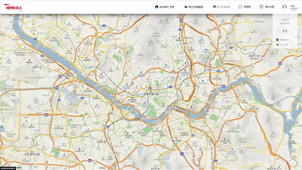
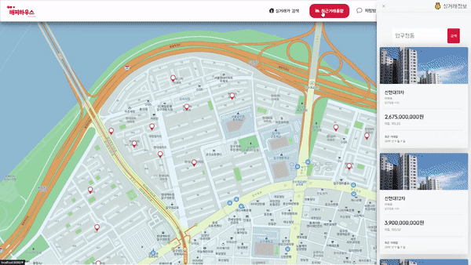
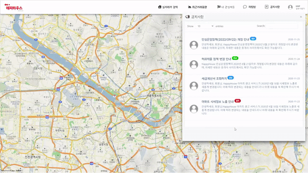

# [real-estate-helper](https://github.com/jaehyunup/realestate-helper-backendServer)

-green.svg)

##? Overview!!
프로젝트로 개발한 부동산 투자를 앞둔 유저들에게 도움을 줄 수 있는 사이트의 프론트앤드 서버입니다.

##? 개발환경
- 기본 환경
    - IDE : IntelliJ
    - OS : Windows
    - Git
- 웹서비스 개발환경
    - Vue.js
    - Javascript
    - npm
    - Vue-cli
- Dependency
    - kakaomap-api
    - 공공데이터포털 데이터
    - [real-estate-helper-backendServer](https://github.com/jaehyunup/realestate-helper-backendServer) 

##? Screen Shots  

###메인   
  
처음이용하는 유저도 자연스럽게 모든 기능에 접근할 수 있게끔 낮은 Layer를 가진 UI를 구현하려고 노력하였습니다.  

###? 유저관리 (회원가입 및 로그인 등)
     
사용자는 회원가입 과정에서 별도의 버튼없이 자연스럽게 닉네임 ,아이디 중복체크가 가능하게 됩니다.  

###? 유저 닉네임 변경
    
사용자는 닉네임을 변경할 수 있으며, 이과정에서 자연스러운 중복체크 과정을 거치게 됩니다.  

###? 아파트 실거래가 검색  
   
법정동명을 입력해서 해당 법정동의 아파트 실거래가 내역을 볼 수 있습니다.    

###? 아파트 상세정보 보기        
  
아파트 목록을 클릭하면 해당 아파트의 상세정보를 알 수 있으며, 
이 과정에서 실시간으로 별도의 이미지크롤링 서버를 도입하여 
동적으로 아파트 이미지를 제공하며,아파트 평수별 가격 변동, 아파트정보,주변 안심병원&보건소 등 관련정보를 얻을 수 있습니다.  

###? 관심매물 관리  
  
관심있는 아파트의 거래내역을 관심매물로 등록하여 주시할 수 있으며, 관리할 수 있습니다.  

###? 지역구 분석기능  
  
선택한 지역구내 아파트 거래량 변동, 나이&성별 별 활동인구 분석 등 여러가지 데이터를 시각화하여
해당 지역구 데이터를 시각화하였습니다.  

###? 익명 채팅방
  
접속한 모든 사용자가 공유하는 익명채팅방입니다. 별도의 Nodejs 기반 웹소켓을 사용하여 만들어졌습니다

###? 공지사항
  
유저는 공지사항을 볼 수있습니다. 공지사항 등록은 관리자 권한으로 접근가능한 별도의 관리자 페이지에서 가능합니다.

